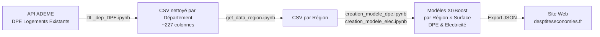

# Des P'tites Economies : desptiteseconomies.fr
 **Projet Capstone** — Analyse et modélisation prédictive des Diagnostics de Performance Énergétique (DPE) en France.

[](https://desptiteseconomies.fr)
[](https://www.python.org/)


## Sommaire

- [Présentation](#-présentation)
- [Prérequis](#-prérequis)
- [Pipeline de données](#-pipeline-de-données)
- [Modélisation](#-modélisation)
- [Site Web](#-site-web)
- [Résultats](#-résultats)
- [Installation](#-installation)
- [Utilisation](#-utilisation)
- [Sources des donnée](#-sources-des-données)
- [Auteurs](#-auteurs)

## Présentation

Ce projet propose un modèle prédictif dont l'objectif est d'évaluer et de réduire l'écart entre les estimations théoriques du Diagnostic de Performance Énergétique (DPE) et la réalité des factures électriques des foyers en France.

En s'appuyant sur les données ouvertes de l'ADEME, cet outil fournit une estimation instantanée pour guider les ménages dans leurs projets de rénovation thermique.

Pour garantir une estimation au plus proche de la réalité (avec des modèles atteignant un R² d'environ 85 %), l'architecture du projet ne repose pas sur un modèle unique, mais sur une multitude de modèles XGBoost segmentés selon trois axes :

La région (Île-de-France, Normandie, Corse, Pays de la Loire, etc.)

La tranche de surface (< 30m², 30-50m², 50-70m², 70-90m², 90-120m², > 120m²)

Le type de prédiction : la consommation énergétique globale (DPE théorique) et la consommation électrique spécifique (facture réelle).

Une fois entraînés, les modèles sont exportés au format JSON et déployés sur notre application web. Les prédictions s'exécutent ainsi de manière fluide et instantanée, directement dans le navigateur de l'utilisateur.

## Prérequis 

| Outil | Usage |
|-------|-------|
| **Python 3.12** | Langage principal |
| **Pandas** | Manipulation de données |
| **NumPy** | Calcul numérique |
| **Scikit-learn** | Prétraitement & métriques |
| **XGBoost** | Modèle de Machine Learning |
| **Matplotlib / Seaborn** | Visualisation |
| **Requests** | Appels API ADEME |
| **Jupyter Notebook** | Exploration & prototypage |
| **HTML / CSS / JS** | Site web front-end |
| **GitHub Pages** | Hébergement du site |

## Pipeline de données



### 1. Collecte des données
- Source : [API ADEME Data Fair](https://data.ademe.fr/data-fair/api/v1/datasets/dpe03existant/lines)
- Pagination automatique avec récupération de toutes les entrées par département
- ~227 colonnes par DPE (caractéristiques du bâtiment, équipements, consommations)

### 2. Fusion régionale
- Agrégation des fichiers départementaux en un fichier par région
- Paramétrable via le code de région et la liste des départements

### 3. Nettoyage & Feature Engineering
- Profilage des colonnes (types, valeurs manquantes, cardinalité)
- Simplification des catégories de chauffage (PAC, Radiateur Électrique, Chaudière, etc.)
- Création de features dérivées (traversant, isolation toiture, tranche de surface)
- Suppression des colonnes avec > 70% de valeurs manquantes

#### Nettoyage complémentaire pour les modèles de prédiction d'électricité 
- Ajout d'une colonne contenant la consommation théorique d'électricité

## Modélisation 

### Algorithmes comparés

| Modèle | Type |
|--------|------|
| Régression Linéaire | Linéaire |
| Régression Ridge | Linéaire (régularisé) |
| Random Forest | Ensemble (Bagging) |
| **XGBoost** | **Ensemble (Boosting)** |

### Segmentation

Les modèles sont entraînés de manière **segmentée** pour capturer les spécificités locales et structurelles :

- **Par région** : chaque région de France métropolitaine dispose de ses propres modèles
- **Par tranche de surface** : 6 tranches (< 30m², 30-50m², 50-70m², 70-90m², 90-120m², > 120m²)
- **Par type** : DPE (consommation globale 5 usages) et Elec (consommation électrique uniquement)

→ Soit jusqu'à **12 modèles par région** (6 tranches × 2 types)

### Variables explicatives principales

#### Variables Catégorielles (Texte / Classes)
- `type_batiment` — Type de bâtiment (ex: appartement, maison individuelle).
- `zone_climatique` — Zone climatique géographique du logement (influe fortement sur les besoins de chauffage selon les régions).
- `classe_altitude` — Tranche d'altitude où se situe le bâtiment.
- `chauffage_simplifie` — Énergie et technologie du chauffage principal (ex: électrique, chaudière gaz, pompe à chaleur).
- `logement_traversant_clean` — Indique si le logement possède des fenêtres sur des façades opposées (favorisant la ventilation naturelle).
- `isolation_toiture_clean` — Présence et état simplifié de l'isolation sous toiture.
- `qualite_isolation_enveloppe` — Évaluation globale de la performance thermique de l'enveloppe extérieure du logement.
- `periode_construction` — Période ou décennie de construction du bâtiment (très liée aux normes thermiques historiques comme la RT2005 ou RT2012).
- `qualite_isolation_murs` — Évaluation spécifique de la déperdition thermique par les murs.
- `qualite_isolation_menuiseries` — Évaluation spécifique de la performance des fenêtres, portes et vitrages.
- `qualite_isolation_plancher_bas` — Évaluation spécifique de l'isolation du sol ou du plancher bas.
- `type_emetteur_installation_chauffage_n1` — Moyen de diffusion de la chaleur (ex: convecteurs électriques, radiateurs à eau, plancher chauffant).
- `type_installation_ecs` — Type d'organisation pour l'Eau Chaude Sanitaire (individuelle ou collective).
- `type_generateur_n1_ecs_n1` — Technologie de l'appareil produisant l'Eau Chaude Sanitaire (ex: ballon thermodynamique, cumulus électrique).
- `presence_brasseur_air` — Indique si le logement est équipé de brasseurs d'air ou ventilateurs de plafond fixes.
- `protection_solaire_exterieure` — Présence de dispositifs bloquant le rayonnement solaire à l'extérieur (ex: volets, stores bannes).
- `presence_climatisation` — Indique si le logement consomme de l'énergie pour le refroidissement (climatisation active).
- `ventilation_simplifiee` — Technologie de renouvellement de l'air (ex: VMC Simple Flux, VMC Double Flux, Naturelle).

#### Variables Numériques (Quantitatives)
- `surface_habitable_logement` — Surface habitable totale du logement (en m²).
- `annee_construction` — Année exacte de l'achèvement de la construction.
- `hauteur_sous_plafond` — Hauteur moyenne entre le sol et le plafond (en mètres), permettant d'estimer le volume à chauffer.
- `ubat_w_par_m2_k` — Coefficient de déperdition thermique moyen du bâtiment ($W/m^2.K$). Plus ce chiffre est bas, meilleure est l'isolation globale.
- `besoin_chauffage` — Estimation des besoins théoriques en chaleur pour maintenir le logement à bonne température.
- `apport_solaire_saison_chauffe` — Quantité de chaleur gratuite (apports bioclimatiques) apportée par le soleil durant les mois d'hiver.

### Métriques d'évaluation

- **R² (Coefficient de détermination)** — Proportion de variance expliquée
- **RMSE (Root Mean Squared Error)** — Erreur moyenne de prédiction (en kWh)

### Résultats (extrait)

| Région | Tranche | Type | R² | RMSE |
|--------|---------|------|----|------|
| Corse | 50-70m² | Elec | **0.909** | 911 |
| Corse | < 30m² | Elec | **0.918** | 336 |
| Corse | 70-90m² | DPE | **0.909** | 1 803 |
| Pays de la Loire | 30-50m² | Elec | **0.902** | 835 |
| Pays de la Loire | 90-120m² | DPE | **0.899** | 2 910 |

*Les résultats des modèles existants sont trouvables dans le fichier `performances_modeles.csv`*

## Site Web

Le site **[desptiteseconomies.fr](https://desptiteseconomies.fr)** permet aux utilisateurs d'estimer la consommation énergétique de leur logement.

### Fonctionnalités
- **Formulaire d'estimation** : saisie des caractéristiques du logement
- **Prédiction en temps réel** : inférence XGBoost directement dans le navigateur (JavaScript)
- **Résultats détaillés** : consommation estimée avec visualisations
- **Bons gestes** : conseils personnalisés pour réduire sa consommation
- **Responsive** : versions desktop et mobile dédiées

### Architecture technique
Les modèles XGBoost sont convertis en JSON et interprétés côté client via `xgboost-predict.js`, permettant une prédiction **sans serveur back-end**.

## ⚙️ Installation

### Prérequis
- Python 3.12+
- pip

### Mise en place

```bash
# Cloner le dépôt
git clone https://github.com/<votre-username>/Projet-DPE.git
cd Projet-DPE/Analyse

# Créer un environnement virtuel
python -m venv .venv

# Activer l'environnement
# Windows :
.venv\Scripts\activate
# macOS/Linux :
source .venv/bin/activate

# Installer les dépendances
pip install -r requirements.txt
```

### Vérifier l'installation

```bash
python test_installation.py
```

## Utilisation 

#### Lancer la pipeline téléchargement des données jusqu'à la création des modèles pour une région
Ouvrir `Analyse_main_region.ipynb` et modifier la variable `ma_region` avec le nom complet de la région, `region_code` avec l'abbrévation de la région et `mes_departements` avec la liste des départements de la région. 

*Exemple :*
```code
ma_region = 'Provence_Alpes_Cote_Azur'
region_code = 'PACA'
mes_departements = ['05','04','06','13','83','84']
```

## Source des données

- **ADEME** — [Base DPE Logements Existants (depuis juillet 2021)](https://data.ademe.fr/datasets/dpe-v2-logements-existants)
- API : `https://data.ademe.fr/data-fair/api/v1/datasets/dpe03existant/lines`
- ~227 colonnes par diagnostic, couvrant les caractéristiques du bâtiment, les équipements, les consommations estimées et les émissions de GES.

---

## Auteurs

Projet réalisé dans le cadre des défis [Data.gouv](https://defis.data.gouv.fr/defis/diagnostics-de-performance-energetique), encadré par [Latitudes](https://www.opendatauniversity.org/) et [HEC](https://www.hec.edu/fr). 

Ce projet a été réalisé par 5 étudiants en troisième année du CPES Sciences des Données, Société et Santé commun à l'Université Paris-Saclay, l'Institut Polytechnique de Paris, le Lycée International de Palaiseau Paris-Saclay, HEC. : 
- Nathan Baudron
- Clément Fritsch--Vidal
- Tristan Paillot
- Lily-Mei Thibault
- Eleana Tran


<p align="center">
  <i>Des P'tites Economies </i>
</p>
